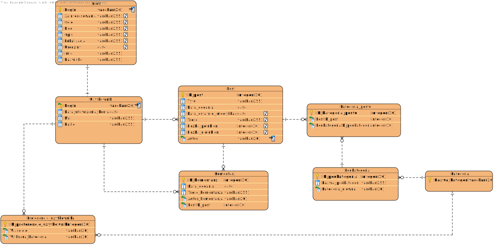

# Blog

| Nazwisko i imię | Wydział | Kierunek | Semestr | Grupa | Rok akademicki |
| :-------------: | :-----: | :------: | :-----: | :---: | :------------: |
| Dyrda Karina    | WIMiIP  | IS       |   4     | 1     | 2019/2020      |
| Fajer Julia     | WIMiIP  | IS       |   4     | 1     | 2019/2020      |

## Projekt bazy danych
Tematem naszego projketu jest blog internetowy. Opiera się on na dodawaniu i wyświetlaniu postów, komentowaniu i reagowaniu na nie. Dodatkowo każdy zarejestrowany użytkownik może spersonalizować swój profil, który może zostać wyświetlony przez pozostałych. Wszystkie posty znjadują się w poszczególnych kategoriach, co ułatwia ich przeglądanie.

Schemat bazy danych:



## Implementacja zapytań SQL
 
 1.	Przeszukiwanie postu w podkategorii fauna. Dodatkowo użytkownik życzy sobie posortować wyniki wyszukiwania po liczbie polubień. 
```sql
SELECT * 
	FROM post 
	JOIN kategoria_postu 
		  ON ID_post=PostID_post 
	ORDER BY Liczba_polubien DESC;
 ```
 
2.	Przeszukiwanie użytkowników względem liczby napisanych postów posortowanych malejąco. 
```sql
        SELECT count(*) as ilosc_postow, login, mail 
	FROM post
	JOIN uzytkownik 
		    ON Autor = Login 
	GROUP BY Login 
	ORDER BY ilosc_postow DESC;
 ```
 
 3.	Wyświetlenie wszystkich profili osób pochodzących z Krakowa, posorotowanych względem daty urodzin. 
```sql
  SELECT * 
	FROM `profil` 
	WHERE Lokalizacja = 'Krakow'
	ORDER BY Urodziny;
```

4.	Wyświetlenie komentarzy dla postu z największą liczbą nielubień. 
```sql
SELECT * 
	FROM `post` 
	JOIN komentarz 
		    ON PostId_post = ID_post 
	WHERE Liczba_nielubien = (SELECT max(Liczba_nielubien) FROM `post`);
 ```
 
5.	Posortowanie podkategorii postu względem ilości wstawionych postów.
```sql
SELECT count(*),Nazwa_podkategorii 
	FROM `podkategoria` 
	LEFT JOIN `kategoria_postu` 
		 ON ID_podkategoria = PodkategoriaID_podkategoria  
		 	JOIN post 
				ON PostId_post = ID_post 
	GROUP BY Nazwa_podkategorii;
 ```
 
 6.	Wyświetlenie wszystkich postów w podkategorii nauki ścisłe (albo innej) względem daty dodania. 
```sql
  SELECT * 
	FROM post 
	JOIN kategoria_postu 
		  ON ID_post=PostID_post 
	WHERE PodkategoriaID_podkategoria = 171;
 ```
 
 7.	Wyświetlenie postów użytkownika Jan Kowalski. 
```sql
  SELECT * FROM post 
	JOIN profil 
		  ON Autor=Login 
	WHERE imie="Jan" && nazwisko="Kowalski";
 ```
 
 8.	Wyświetlenie komentarzy napisanych przez Jana Kowalskiego. 
```sql
  SELECT * 
	FROM komentarz 
	JOIN profil 
		  ON Autor_komentarza=Login 
	WHERE imie="Jan" && nazwisko="Kowalski";
 ```
   
 9.  Wyświetlenie profilu i preferowanych kategorii użytkownika o loginie mkoperek. 
```sql
  SELECT Login, Imie, Nazwisko, Plec, Lokalizacja, Urodziny, Zainteresowania, Cele, Opis, Wybrana_kategoria
	FROM preferencje_uzytkownika
    	FULL JOIN profil 
		  ON Login='mkoperek'
	WHERE Wlasciciel='mkoperek';
 ```
   
 10. Wyświetlenie wszystkich postów zawierających w tytule słowo "sukienki", posortowanych według daty ostatniej modyfikacji. 
```sql 
  SELECT *
	FROM post
	WHERE Tytul LIKE '%sukienki%'
	ORDER BY Data_ostatniej_modyfikacji;
 ```
   
 11. Aktualizowanie profilu zalogowanego użytkownika zbigniewduda 
```sql
  UPDATE profil 
	SET Zainteresowania='Sport na swiezym powietrzu', Cele='Poprzedni cel zdobyty, kolejny to zdobyc Mount Everest', Opis='Pozytywnie zakrecony', Lokalizacja='Olsztyn' 
	WHERE Login='zbigniewduda';
 ```
   
 12. Wyświetlenie danych zalogowanego użytkownika nowakanna. 
```sql
  SELECT Login,Mail,Data_utworzenia_konta 
	FROM uzytkownik 
	WHERE Login='nowakanna';
```
  
 13.  Użytkownik ma możliwość zarejestrowania się. 
```sql
  INSERT INTO `uzytkownik` (`Login`, `Mail`, `Haslo`, `Data_utworzenia_konta`) 
		VALUES('Karen2035', 'dyrda.karina@gmail.com', 'eloelo320', '2020-06-02');
	INSERT INTO `profil` (`Login`, `Plec`, `Lokalizacja`, `Urodziny`, `Imie`, `Nazwisko`) 
		VALUES ('Karen2035', 'Kobieta', 'Krakow', '1999-01-02', 'Karina', 'Dyrda');
```
 
 14. Użytkownik ma mozliwość wyswietlenia wszystkich istniejących kategorii według nazwy kategorii w odwróconej kolejności alfabetycznej. 
 ```sql
        SELECT Nazwa_kategorii 
	FROM kategoria
	ORDER BY Nazwa_kategorii DESC;
```
 
 15. 	Użytkownik ma mozliwość wyświetlenia wszystkich istniejących podkategorii dla wybranej kategorii (np. dla kategorii moda). 
```sql
  SELECT ID_podkategoria,Nazwa_podkategorii 
	FROM podkategoria 
	WHERE Kategoria_glowna='Moda';
```
   
 16. Użytkownik ma możliowsc wyświetlania wszystkich napisanych postów posortowanych alfabetycznie według loginu autora. 
```sql
  SELECT ID_post,Autor,Tytul,Data_dodania,Data_ostatniej_modyfikacji,Tresc, Liczba_polubien,Liczba_nielubien 
	FROM post 
	ORDER BY Autor;
```
   
 17.  Użytkownik ma mozliwość wstawienia swojego własnego posta. 
```sql
  INSERT INTO post(Tytul,Data_dodania,Data_ostatniej_modyfikacji,Tresc,Autor)
		VALUES('Moj pierwszy post', CURDATE(), CURDATE(), 'Witam witam', 'mkoperek');
```
   
 18. Użytkownik może stworzyć profil związany ze swoim kontem. 
```sql
  INSERT INTO `profil` (`Login`,`Imie`,`Nazwisko`,`Urodziny`,`Plec`) 
		VALUES('Whitiee', 'Julia', 'Fajer', '1999-10-20', 'Kobieta');
 ```
   
 19. Polubienie postu (funkcjonalność bierze ID postu, który aktualnie przegląda użytkownik) gdzie ID przeglądanego postu wynosi 6 . 
```sql
  UPDATE post 
	SET Liczba_polubien = Liczba_polubien + 1 
	WHERE ID_post='6';
 ```
 
 20. Dodanie komentarza o treści "Witam" przez zalogowanego użytkownika jankowalski do aktualnie wyświetlanego postu 
	(data generowana automatycznie, użytkownik aktualnie przegląda post o ID = 6). 
```sql
  INSERT INTO komentarz(Data_dodania,Tresc_komentarza,PostID_post,Autor_komentarza) 
		VALUES(CURDATE(),'Witam','6','jankowalski');
 ```
    
## Aplikacja
Aplikacja napisana została w języku python uwzględniając interakcję z użytkownikiem. Posiada ona główne menu, które udostępnia podstawowe funkcjonalności wykorzystujące omówione zapytania takie jak przeglądanie katalogu postów, profili innych użytkowników, możliowość rejesteracji i logowanie. Po udanym zalogowaniu użytkownik ma dostęp do bardziej zaawansowanych funkcji w tym dodawanie komentarzy, tworzenie postów, tworzenie i edytowanie własnego profilu, czy wyświetlenie swoich danych. Dodatkowo taka osoba może wyświetlić sekcję "Wybrane dla Ciebie", w której wyświetlone zostaną preferowane katgorie. Użytkownik może wyświetlić posty należące do tych kategorii, bez konieczności przeglądania wszystkich dostępnych tematów. Niezalogowany użytkownik oprócz wyświetlenia postów wybranej podkategorii może jedynie zareagować na niego dając polubienie lub nielubienie, nie może jednak komentować postów.

Snippety:
1. Dodawanie komentarza:
```py
  def dodajKomentarz(self,post):
        tresc = input('Podaj tresc komentarza : ')
        return str('''INSERT INTO komentarz(`Data_dodania`,`Tresc_komentarza`,`PostID_post`,`Autor_komentarza`) VALUES('{}','{}','{}','{}')'''.format(datetime.date.today(),tresc,post,self.login))
---------------------------------------------------------------------------------------------------------------------------------------------------------------------------------------------------
  zapytanie = self.log().dodajKomentarz(post[0])
  self.kursor.execute(zapytanie)
  self.polaczenie.commit()
```

2. Dodawnie napisanego postu:
```py
    def napiszPost(self):  #zwraca liste dla klasy glownej
        tytul = input('Podaj tytul postu: ')
        data = datetime.date.today()
        dataMod = datetime.date.today()
        tresc = input('Podaj tresc postu: ')

        return ['''INSERT INTO post(Tytul,Data_dodania,Data_ostatniej_modyfikacji,Tresc,Liczba_polubien,Liczba_nielubien,Autor)
VALUES(\'%s\',\'%s\',\'%s\',\'%s\',\'%s\',\'%s\',\'%s\')''' % (tytul,data,dataMod,tresc,0,0,self.login),(tytul,data,dataMod,tresc,0,0,self.login)]
----------------------------------------------------------------------------------------------------------------------------------------------------------------------------------------------------------------------------------------------------------------------------------
    def dodajPost(self):
        if self.log().zalogowany():
            zapytanie=self.log().napiszPost()
            self.kursor.execute(zapytanie[0])
            self.kursor.execute('SELECT ID_post FROM post WHERE Tytul=%s AND Data_dodania= %s AND Data_ostatniej_modyfikacji=%s AND Tresc =%s AND Liczba_polubien=%s AND Liczba_nielubien=%s AND Autor=%s',zapytanie[1])
            post = self.kursor.fetchone()[0]
            podkategorie = self.wyswPodkategorie(None)
            while 1:
                a = input('Wybierz podkategorie postu: ')
                jest = False
                for pod in podkategorie:
                    if pod[0] ==int(a):

                        jest = True
                if jest:
                    self.__dolaczPodkategoriePostu(post,a)
                    break
                else:
                    print('Nie ma takiej podkategorii')
                    continue
            print('Dodano post !')
            self.polaczenie.commit()
                 
        else:
            print('ERROR')
```
3. Wyswietlanie wybranych dla Ciebie:
``` py
    def wysywDlaCiebie(self):
        return '''SELECT ID_preferencje_uzytkownika,Wybrana_kategoria FROM preferencje_uzytkownika WHERE Wlasciciel=\'%s\'''' % self.login
----------------------------------------------------------------------------------------------------------------------------------------
    def kategorieDlaUzytkownika(self):
        if self.log().zalogowany():
            zapytanie = self.log().wysywDlaCiebie()
            self.kursor.execute(zapytanie)
            twoje = self.kursor.fetchall()
            print('Wybrane dla Ciebie: ')
            for twoj in twoje:
                print('\t{}. {}'.format(twoj[0],twoj[1]))
            a=input('1. Wybierz kategorie q. Cofnij\n')
            if a =='1':
                kat = input('Podaj kategorie: ')
                for twoj in twoje:
                    if twoj[0]==int(kat):
                        self.wybierzPodkategorie(twoj[1])
            elif a=='q':
                return
        else:
            print('ERROR')
```
4. Wygląd menu:

    głównego:
```py
            podany = input('WYBIERZ:\n 1. Wyswietl Kategorie \n 2. Zaloguj \n 3. Zarejestruj \n 4. Zakoncz\n')
            if podany == '1':
                bd.wybierzKategorie()
            elif podany == '2':
                bd.logowanie()
            elif podany == '3':
                bd.rejestracja()
            elif podany == '4':
                bd.close()
                print('Koniec')
                break
            else:
                print('Zla wartosc')
                continue
```
   po zalogowaniu:
```py

podany = input('''WYBIERZ:\n 1. Wyswietl Kategorie \n 2. Wyswietl Profil \n 3. Wyswietl Wszystkie posty \n 4. Wybrane dla Ciebie \n 5. Dodaj Post \n 6. Wyswietl swoje dane 
 7. Edytuj swoj profil \n 8. Wyloguj\n''')
            if podany == '1':
                bd.wybierzKategorie()
            elif podany == '2':
                login=input('***Podaj nazwe uzytkownika: ')
                bd.wyswProfil(login)
            elif podany == '3':
                bd.pokazWszystkiePosty()
            elif podany == '4':
                bd.kategorieDlaUzytkownika()
            elif podany == '5':
                bd.dodajPost()
            elif podany == '6':
                bd.wyswDane()
            elif podany == '7':
                bd.edytujProfil()
            elif podany == '8':
                bd.log().wyloguj()


```
## Dodatkowe uwagi
W programie zaimplementowana została większość opisanych zapytań. Daną aplikację można w przyszłości rozbudować o większą liczbę bardziej zaawansowanych funkcjonalności wymienionych również powyżej.
